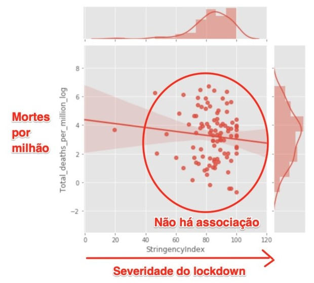
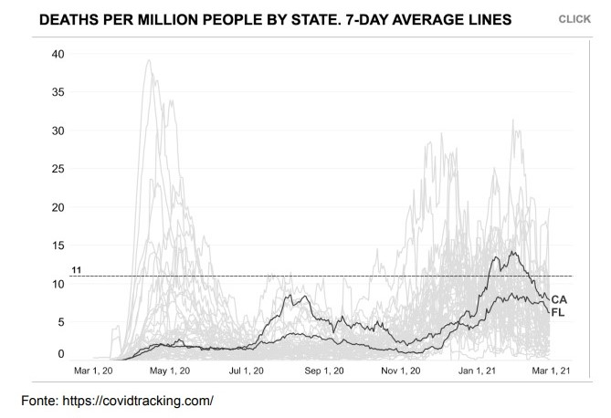
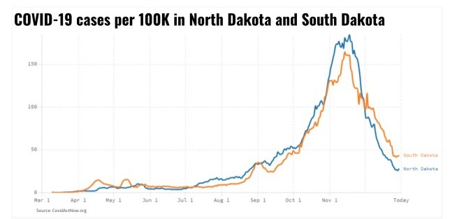
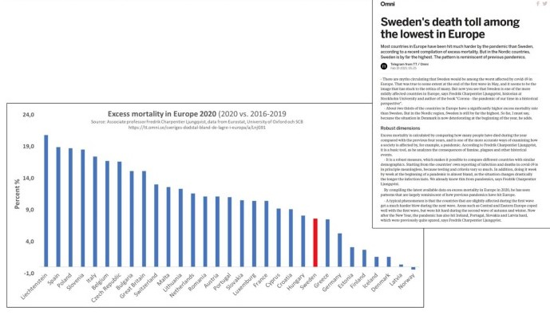

# Lockdowns

 > **"Lockdowns são o maior erro de saúde pública já cometido  na história."**
> 
 > Prof. Martin Kulldorff, professor de medicina da Univ. de Harvard. 
 

## A ORGANIZAÇÃO MUNDIAL DA SAÚDE É CONTRA LOCKDOWN 
 
Em outubro de 2020, a OMS se posicionou oficialmente pedindo aos governos do mundo pararem de usar lockdowns como intervenção primária devido aos catastróficos danos que eles 
causam. 

 - ~~[Referência](https://www.msn.com/en-us/health/medical/who-official-urges-world-leaders-to-stop-using-lockdowns-as-primary-virus-control-method/ar-BB19TBUo)~~
 - [Wayback Machine](https://web.archive.org/web/20201101045343/https://www.msn.com/en-us/health/medical/who-official-urges-world-leaders-to-stop-using-lockdowns-as-primary-virus-control-method/ar-BB19TBUo)
 
 
 
## A CIÊNCIA DOS LOCKDOWNS 
 
Apesar de ser "intuitivo" se acreditar que ao se limitar a mobilidade das pessoas via lockdowns teria impacto positivo na contenção da doença, os dados já coletados ao redor do mundo por mais de um ano, analisados cuidadosamente e publicados independentemente ou em jornais científicos importantes mostram uma história diferente. Lockdowns não tem efeito significativo na contenção de vírus respiratórios (como Sars-Cov-2) e causam enormes danos sociais, psicológicos e econômicos à sociedade. 
 
### Revista Nature

Estudo recém publicado na conceituada revista Nature e conduzido no Brasil pela UFRS e  UNISINOS:  Ao analisar uma possível associação entre lockdowns e redução/aumento de número de  mortes atribuídas a COVID em 87 regiões ao redor do mundo o estudo conclui: **"Com nossos  resultados, nós não conseguimos mostrar que a mortalidade por COVID foi reduzida pelo uso  de lockdowns em 98% dos casos."** 

 - ~~[Referência](https://www.nature.com/articles/s41598-021-84092-1)~~
 - [Wayback Machine](https://web.archive.org/web/20210815215101/https://www.nature.com/articles/s41598-021-84092-1)
 
### Jornal Europeu de Investigação

Novo estudo peer-reviewed publicado no Jornal Europeu de Investigação Clínica e conduzido pela Universidade de Stanford buscou avaliar usando dados de 10 países o impacto de ordens de "ficar em casa" e fechamento de negócios (lockdown) no crescimento de casos de COVID. Conclusão: "[...] Nós não encontramos benefícios significativos em termos de crescimento de casos com o uso de ações mais restritivas. Reduções similares podem ser atingidas com intervenções menos restritivas." 
 
 - [Referência](https://pubmed.ncbi.nlm.nih.gov/33400268/)
 
### Universidade de Aarhus na Suécia

Estudo conduzido na Universidade de Aarhus na Suécia analisou dados de mortalidade e lockdowns de 24 países europeus durante a primeira onda forte de lockdowns em 2020 e 
concluiu que "Não encontrei nenhuma associação entre políticas de lockdown e desenvolvimento de mortalidade." 

 - [Referência](https://papers.ssrn.com/sol3/papers.cfm?abstract_id=3665588)
 
### Universidade de Alberta no Canadá 

Estudo conduzido pelo médico e professor de medicina Ari R Joffe pela Universidade de Alberta no Canadá, conclusão: 
 > "Uma análise de custo-benefício da resposta a COVID-19 conclui que lockdowns são muito mais danosos para saúde pública (no mínimo 5-10 vezes) do que a própria COVID-19." 
 
 - [Referência](https://pubmed.ncbi.nlm.nih.gov/33718322) 
 
### PANDADATA.org

Análise de dados de dezenas de países conduzida pela PANDADATA.org cruzando severidade de lockdown com número de mortes por milhão de pessoas de dezenas de países não 
encontrou nenhuma associação entre uma coisa ou outra, sugerindo que lockdowns não impactam significativamente o curso da doença. 

 
No gráfico, cada ponto é um país. Percebe-se que n ão há nenhuma correlação entre lockdowns severos e mortalidade. Não há padrão evidente. 
 
 - [Referência](https://thefatemperor.com/wp-content/uploads/2020/11/19.-PANDA-Exploring-inter-country-coronavirus-mortality.pdf)
 
 
## DANOS CATASTRÓFICOS DOCUMENTADOS DOS LOCKDOWNS 
 
Um grupo de cientistas de alto calibre, liderado pela professora de epidemiologia da Univ. de Oxford, Sunetra Gupta, Professor de Medicina Baseada em Evidências de Oxford, Carl 
Heneghan, Professor de medicina de Harvard Prof. Martin Kulldorff e professor de medicina de Stanford Jay Bhattacharya compilam a melhor literatura peer-reviewed disponível sobre os massivos danos causados pelas políticas de lockdown, incluindo aumento de mortes evitáveis por câncer, aumento de incidência de problemas mentais, critico impacto na saúde 
cardiovascular, saúde infantil, cirurgias, suicídios, obesidade, violência doméstica, pobreza, etc. 
 
Os danos causados pelos lockdowns são incalculáveis e absolutamente concretos. Tendo em vista a forte aparente evidência da sua ineficiência no propósito que é utilizado, estes danos podem estar sendo causados em troco benefício nenhum. 
 
 - [Para todas evidências...](https://collateralglobal.org/research)
 
## ESTUDOS DE CASOS PARA CONSIDERAR 
 
### FLÓRIDA 
 
O estado da Flórida abriu completamente há mais de 6 meses e apesar de ter a população 
mais idosa dos EUA, possui números melhores em termos de COVID do que muitos outros 
estados americanos. 
 
Recentemente o governador DeSantis da Flórida fez uma audiência publica sobre as medidas 
de COVID convidando experts epidemiologistas para discutir tudo. Esta audiência completa 
está aqui e propõe que lockdowns não são a resposta: 
https://www.youtube.com/watch?v=-V7ZqnoKdUQ 
 
A Flórida (completamente aberta há meses) ao comparar-se com a Califórnia (um dos estados 
mais fechados dos EUA) possuem melhores números de mortes por milhão de pessoas: 
 

 - [Fonte)(https://covidtracking.com/)

> Nota: A Flórida foi criticada por não ter vacinado a população rápido o suficiente, ou seja, apenas uma pequena parcela da população está vacinada e menos ainda estavam quando as politicas restritivas foram retiradas.  
 
### TEXAS 
 

Texas sempre teve negócios abertos com pelo menos 50% de capacidade e mais recentemente retirou completamente todas restrições (sem lockdown, sem máscaras) com todos negócios permitidos a funcionar com 100% de capacidade. Nada negativo foi observado depois disso. 
 
### DAKOTA NORTE E DAKOTA DO SUL 
 
O caso dos estados da Dakota do Norte e Dakota do Sul, vizinhos geograficamente, é 
interessante onde no norte houve lockdown e máscaras e no sul nunca houve nem um nem 
outro. Quando olhamos números de mortes e casos, ambos são compatíveis. 
 

 
Os dados sugerem que as medidas restritivas aplicadas por um, mas não o outro estado, não 
mudaram o curso da doença que seguiu sua curva natural. 
 
### 44 ESTADOS AMERICANOS ESTÃO ABERTOS 
 
Nos EUA, 44 estados estão com a grande maioria dos negócios abertos. Ainda nos EUA, 15 
estados estão sem mandatos de máscaras. O mapa completo destas restrições está abaixo e é 
mantido atualizado pelo New York Times: 
https://www.nytimes.com/interactive/2020/us/states-reopen-map-coronavirus.html 
 
  

### SUÉCIA 
 
Muito se diz sobre a Suécia na mídia, afinal, foi um dos poucos países que desde o início se opôs a mandatos de máscaras e lockdown (nunca tiveram nem um, nem outro).  
Mesmo assim, dados completos de 2020 mostram que a Suécia teve uma das mais baixas taxas de excesso de mortalidade da Europa, ainda mais quando comparado a países que 
fizeram lockdowns severos como Itália, Espanha, Grã Bretanha, etc. Isso sugere novamente que a doença segue seu curso e estas medidas não têm impacto significativo. 

 
 
 
## O MELHOR CURSO A SER SEGUIDO 
 
Está na hora de ouvirmos os verdadeiros experts, seguirmos a melhor ciência disponível (e a OMS) e começarmos de fato a usar de medidas inteligentes e eficazes para retomarmos a 
vitalidade da sociedade enquanto ainda protegendo quem precisa. 
 
 1. Segundo os mais conceituados experts do mundo em doenças infecciosas, epidemiologia e  medicina, lockdowns não são a resposta: 
  
 Uma declaração importante (Great Barrington Declaration) escrita por 3 dos maiores  epidemiologistas do mundo, de Harvard, Oxford e Stanford e co-assinada já por 13.837 
 cientistas de saúde pública e medicina e 42.059 profissionais da área médica, diz:  "Como epidemiologistas de doenças infecdiosas e cientistas da saúde pública, temos sérias 
 preocupações sobre os impactos prejudiciais para a saúde física e mental das políticas prevalecentes da COVID-19, e recomendamos uma abordagem a que chamamos Proteção 
 Focalizada." "A adoção de medidas para proteger os vulneráveis deve ser o objectivo central das respostas de saúde pública à COVID-19." 

 > "Aqueles que não são vulneráveis devem ser imediatamente autorizados a retomar a vida  normal." 

 [A declaração completa traduzida para Português pode ser encontrada aqui](https://gbdeclaration.org/)
 
 2. Ainda, alinhado com isso, PANDATA.org publicou um guia (em inglês) para reabertura segura 
 da sociedade baseado em todas informações e ciência que já coletamos ao longo deste mais 
 de 1 ano de pandemia. 
 [O guia está aqui](https://www.pandata.org/about/protocol-for-reopening-society/)
